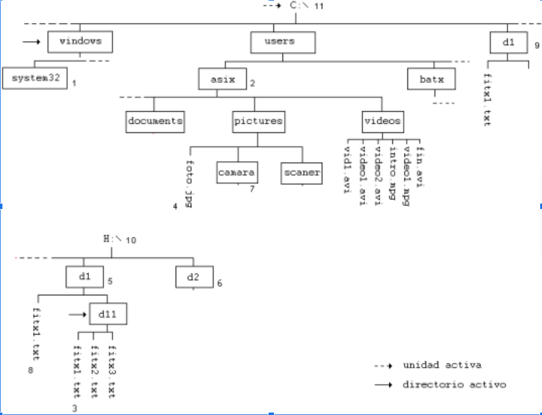

| **Elemento nº** |  **Utilizando rutas absolutas** |  **Utilizando rutas relativas** |
|:---------------:|:-------------------------------:|:-------------------------------:|
|      **1**      |       C:\windows\system32\      |             system32            |
|      **2**      |          C:\users\asix          |          ..\users\asix          |
|      **3**      |       H:\d1\d11\fitx1.txt       |            fitx1.txt            |
|      **4**      | C:\users\asix\pictures\foto.jpg | ..\users\asix\pictures\foto.jpg |
|      **5**      |              H:\d1              |                ..               |
|      **6**      |              H:\d2              |             ..\..\d2            |
|      **7**      |  C:\users\asix\pictures\camara  |  ..\users\asix\pictures\camara  |
|      **8**      |         H:\d1\fitx1.txt         |           ..\fitx1.txt          |
|      **9**      |              C:\d1              |              ..\d1              |
|      **10**     |                H:               |               H:\               |
|      **11**     |                C:               |               C:\               |

